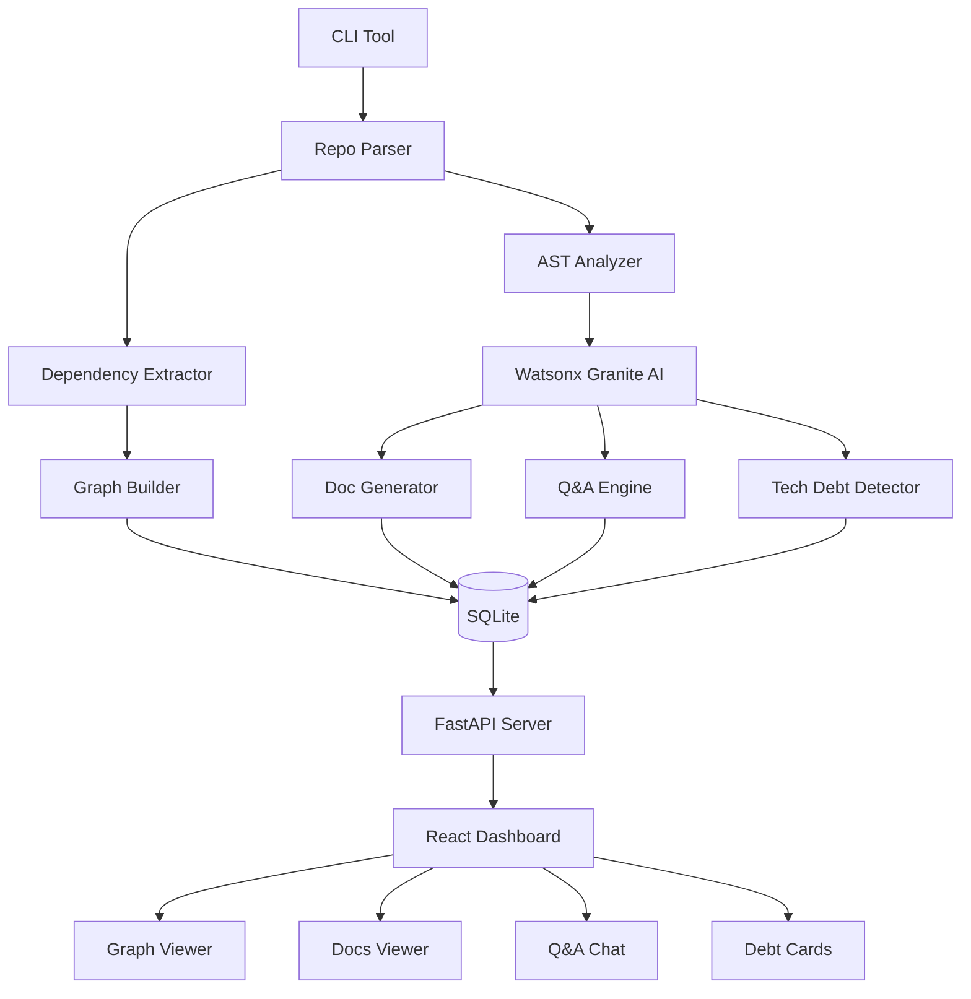

# CodeLens - Intelligent Repository Analysis Platform
## Phased Implementation Plan

---

## 🎯 Project Mission

**CodeLens** helps developers understand unfamiliar codebases quickly through AI-powered analysis. Primary use cases:

1. **New Team Members** - Fast onboarding with auto-generated architecture docs
2. **Senior Developers** - Audit unfamiliar repositories efficiently  
3. **Development Teams** - Maintain living documentation automatically
4. **Code Reviews** - Understand dependencies and impact of changes

---

## 🏗️ Core Features (Priority Order)

1. **Interactive Architecture/Dependency Graph** - Visual map of how modules connect
2. **Auto-Generated Onboarding Documentation** - Plain English explanations of codebase structure
3. **Q&A Interface** - Ask questions about the codebase and get AI-powered answers
4. **Tech-Debt Detection** - Identify code quality issues with prioritized improvement cards

---

## 🛠️ Technology Stack

- **Backend:** Python 3.11+, FastAPI
- **Frontend:** React 18+ with TypeScript
- **Database:** SQLite (local file-based)
- **AI Engine:** IBM watsonx.ai Granite models
- **CLI:** Typer with Rich formatting
- **Graph Viz:** React Flow
- **Deployment:** Local execution (no cloud infrastructure needed)
- **Language Support:** Python + JavaScript/TypeScript (initial release)

---

## 📊 System Architecture



---

## 📁 Project Structure

```
CodeLens/
├── backend/
│   ├── app/
│   │   ├── __init__.py
│   │   ├── main.py                    # FastAPI app
│   │   ├── config.py                  # Configuration
│   │   ├── database.py                # SQLite setup
│   │   │
│   │   ├── models/                    # Database models
│   │   │   ├── __init__.py
│   │   │   ├── project.py
│   │   │   ├── analysis.py
│   │   │   ├── graph.py
│   │   │   └── qa.py
│   │   │
│   │   ├── schemas/                   # Pydantic schemas
│   │   │   ├── __init__.py
│   │   │   ├── project.py
│   │   │   ├── graph.py
│   │   │   └── analysis.py
│   │   │
│   │   ├── api/                       # API routes
│   │   │   ├── __init__.py
│   │   │   ├── projects.py
│   │   │   ├── analysis.py
│   │   │   ├── graph.py
│   │   │   ├── docs.py
│   │   │   ├── qa.py
│   │   │   └── tech_debt.py
│   │   │
│   │   ├── services/                  # Core business logic
│   │   │   ├── __init__.py
│   │   │   ├── repo_parser.py         # Parse repository
│   │   │   ├── ast_analyzer.py        # AST parsing
│   │   │   ├── dependency_analyzer.py # Extract dependencies
│   │   │   ├── graph_builder.py       # Build graph structure
│   │   │   ├── doc_generator.py       # Generate docs
│   │   │   ├── qa_engine.py           # Q&A with RAG
│   │   │   ├── tech_debt_detector.py  # Code quality
│   │   │   └── watsonx_client.py      # AI integration
│   │   │
│   │   └── utils/
│   │       ├── __init__.py
│   │       ├── file_utils.py
│   │       ├── code_metrics.py
│   │       └── logger.py
│   │
│   ├── cli/
│   │   ├── __init__.py
│   │   ├── main.py                    # CLI entry point
│   │   └── commands/
│   │       ├── __init__.py
│   │       ├── analyze.py
│   │       └── serve.py
│   │
│   ├── tests/
│   │   ├── __init__.py
│   │   ├── conftest.py
│   │   └── test_services/
│   │
│   ├── requirements.txt
│   ├── setup.py
│   └── README.md
│
├── frontend/
│   ├── public/
│   │   └── index.html
│   │
│   ├── src/
│   │   ├── App.tsx
│   │   ├── index.tsx
│   │   │
│   │   ├── components/
│   │   │   ├── Layout/
│   │   │   │   ├── Header.tsx
│   │   │   │   └── Sidebar.tsx
│   │   │   │
│   │   │   ├── Graph/
│   │   │   │   ├── DependencyGraph.tsx
│   │   │   │   └── NodeDetails.tsx
│   │   │   │
│   │   │   ├── Documentation/
│   │   │   │   └── DocViewer.tsx
│   │   │   │
│   │   │   ├── QA/
│   │   │   │   ├── ChatInterface.tsx
│   │   │   │   └── MessageList.tsx
│   │   │   │
│   │   │   └── TechDebt/
│   │   │       ├── DebtDashboard.tsx
│   │   │       └── DebtCard.tsx
│   │   │
│   │   ├── services/
│   │   │   └── api.ts
│   │   │
│   │   ├── hooks/
│   │   │   └── useProjects.ts
│   │   │
│   │   └── types/
│   │       └── index.ts
│   │
│   ├── package.json
│   ├── tsconfig.json
│   └── vite.config.ts
│
├── docs/
│   ├── ARCHITECTURE.md
│   ├── API.md
│   └── USER_GUIDE.md
│
├── .gitignore
├── README.md
└── PROJECT_PLAN.md (this file)
```

---

## 🚀 Phased Implementation Plan

### **PHASE 0: Foundation & Setup** ✅ (Week 1)

**Goal:** Set up project structure, environment, and basic infrastructure

**Deliverables:**
- Complete project folder structure
- Python environment with all dependencies
- SQLite database schema
- Basic CLI skeleton
- FastAPI server skeleton
- React frontend skeleton
- Configuration management
- Git repository initialized

**Tasks:**
1. Create all project directories and files
2. Set up Python virtual environment
3. Install backend dependencies (FastAPI, SQLAlchemy, etc.)
4. Create SQLite database schema
5. Implement basic configuration management
6. Set up CLI with Typer
7. Create FastAPI app structure
8. Initialize React project with Vite
9. Set up Git repository with `.gitignore`
10. Write initial README

**Success Criteria:**
- ✅ All folders and files created
- ✅ `pip install -r requirements.txt` works
- ✅ `codelens --help` shows CLI commands
- ✅ FastAPI server starts: `uvicorn app.main:app`
- ✅ React dev server starts: `npm run dev`
- ✅ Database tables created successfully

---

### **PHASE 1: Core Analysis Engine** 🎯 (Weeks 2-3)

**Goal:** Build the foundation for code analysis - parse repos and extract structure

**Deliverables:**
- Repository parser (local paths + GitHub URLs)
- AST analyzer for Python
- AST analyzer for JavaScript/TypeScript
- Dependency extractor
- Basic graph data structure
- File system utilities

**Tasks:**
1. Implement repository cloning with GitPython
2. Build file tree parser with language detection
3. Create Python AST analyzer using `ast` module
4. Create JavaScript/TypeScript AST analyzer using tree-sitter
5. Extract imports, exports, function calls
6. Build dependency relationship mapper
7. Create graph data structure (nodes + edges)
8. Implement file filtering (ignore node_modules, venv, etc.)
9. Add progress tracking for CLI
10. Store analysis results in SQLite

**Success Criteria:**
- ✅ Can clone GitHub repos or read local paths
- ✅ Correctly identifies Python and JS/TS files
- ✅ Extracts all imports and function definitions
- ✅ Builds dependency graph with nodes and edges
- ✅ Stores results in database
- ✅ CLI shows progress during analysis

**Test Repository:** Use a small open-source project (e.g., Flask or Express.js starter)

---

### **PHASE 2: Graph Visualization** 📊 (Week 4)

**Goal:** Create interactive dependency graph in the web dashboard

**Deliverables:**
- Graph API endpoints
- React Flow integration
- Interactive graph component
- Node details panel
- Graph filtering and search
- Basic web UI layout

**Tasks:**
1. Create FastAPI endpoints for graph data
2. Implement graph serialization (nodes + edges JSON)
3. Set up React Flow in frontend
4. Build DependencyGraph component
5. Add node click handlers for details
6. Implement zoom and pan controls
7. Add search/filter functionality
8. Create node detail panel
9. Style nodes by type (file, class, function)
10. Add legend and controls

**Success Criteria:**
- ✅ API returns graph data in correct format
- ✅ Graph renders with all nodes and edges
- ✅ Can click nodes to see details
- ✅ Can zoom, pan, and search
- ✅ Different node types have different colors
- ✅ Graph is responsive and performant

---

### **PHASE 3: AI Integration & Documentation** 📝 (Weeks 5-6)

**Goal:** Integrate watsonx.ai and generate onboarding documentation

**Deliverables:**
- Watsonx.ai client integration
- Documentation generator
- Documentation API endpoints
- Documentation viewer UI
- Auto-generated docs for test repos

**Tasks:**
1. Set up watsonx.ai authentication
2. Create watsonx_client.py with API calls
3. Implement prompt templates for documentation
4. Build documentation generator service
5. Generate project overview section
6. Generate module-by-module explanations
7. Create getting started guide
8. Store documentation in database
9. Build documentation API endpoints
10. Create DocViewer React component
11. Add markdown rendering
12. Add table of contents navigation

**Success Criteria:**
- ✅ Successfully connects to watsonx.ai
- ✅ Generates coherent project overview
- ✅ Explains each major module clearly
- ✅ Creates actionable getting started guide
- ✅ Documentation is readable and well-formatted
- ✅ UI displays docs with navigation

**Documentation Sections:**
1. Project Overview (purpose, tech stack)
2. Architecture Summary (high-level design)
3. Key Modules & Their Roles
4. Data Flow & Interactions
5. Getting Started Guide
6. Common Development Workflows

---

### **PHASE 4: Q&A Interface** 💬 (Week 7)

**Goal:** Enable developers to ask questions about the codebase

**Deliverables:**
- RAG (Retrieval-Augmented Generation) system
- Code embeddings generation
- Q&A engine with context retrieval
- Q&A API endpoints
- Chat interface UI

**Tasks:**
1. Generate code embeddings using sentence-transformers
2. Store embeddings in SQLite
3. Implement semantic search for relevant code
4. Build Q&A engine with RAG pattern
5. Create prompt templates for Q&A
6. Implement conversation history
7. Build Q&A API endpoints
8. Create ChatInterface React component
9. Add suggested questions feature
10. Display code snippets in responses

**Success Criteria:**
- ✅ Can answer "Where is X configured?"
- ✅ Can explain "How does Y work?"
- ✅ Retrieves relevant code context
- ✅ Responses include code snippets
- ✅ Maintains conversation history
- ✅ Suggests relevant follow-up questions

**Example Questions:**
- "How does authentication work in this project?"
- "Where is the database connection configured?"
- "What does the UserService class do?"
- "How do I add a new API endpoint?"

---

### **PHASE 5: Tech Debt Detection** 🔍 (Week 8)

**Goal:** Identify code quality issues and prioritize improvements

**Deliverables:**
- Code complexity analyzer
- Code smell detector
- Dependency vulnerability scanner
- Prioritization algorithm
- Tech debt API endpoints
- Tech debt dashboard UI

**Tasks:**
1. Implement cyclomatic complexity calculation
2. Detect long functions and large classes
3. Identify code duplication
4. Check for outdated dependencies
5. Scan for security vulnerabilities (using bandit)
6. Calculate priority scores
7. Create tech debt API endpoints
8. Build DebtDashboard component
9. Create DebtCard component with details
10. Add filtering by severity/priority

**Success Criteria:**
- ✅ Detects high-complexity functions
- ✅ Identifies code smells accurately
- ✅ Flags outdated dependencies
- ✅ Prioritizes issues correctly
- ✅ UI displays cards with clear actions
- ✅ Can filter and sort issues

**Detection Categories:**
- **Critical:** Security vulnerabilities
- **High:** High complexity, no tests, breaking changes
- **Medium:** Code smells, missing docs
- **Low:** Minor refactoring opportunities

---

### **PHASE 6: Integration & Polish** ✨ (Week 9)

**Goal:** Connect all features, add polish, and prepare for use

**Deliverables:**
- Complete CLI with all commands
- Full API integration
- Unified dashboard
- Error handling
- Loading states
- User documentation

**Tasks:**
1. Complete CLI commands (analyze, serve, export)
2. Add comprehensive error handling
3. Implement loading states in UI
4. Add toast notifications
5. Create unified dashboard view
6. Implement project management (list, delete)
7. Add export functionality (JSON, PDF)
8. Write user documentation
9. Create example workflows
10. Add keyboard shortcuts

**Success Criteria:**
- ✅ All features work end-to-end
- ✅ Graceful error handling everywhere
- ✅ Clear loading indicators
- ✅ User documentation is complete
- ✅ Can analyze real repositories successfully
- ✅ Dashboard is intuitive and responsive

---

### **PHASE 7: Testing & Optimization** 🧪 (Week 10)

**Goal:** Ensure reliability and performance

**Deliverables:**
- Unit tests for core services
- Integration tests for API
- Performance optimizations
- Bug fixes
- Deployment guide

**Tasks:**
1. Write unit tests for analyzers
2. Write tests for graph builder
3. Test API endpoints
4. Test CLI commands
5. Optimize graph rendering performance
6. Optimize AI API calls (caching)
7. Add request rate limiting
8. Profile and optimize slow operations
9. Fix identified bugs
10. Write deployment documentation

**Success Criteria:**
- ✅ Test coverage > 70%
- ✅ All tests pass
- ✅ Analysis completes in < 5 min for medium repos
- ✅ Graph renders smoothly with 100+ nodes
- ✅ No memory leaks
- ✅ Deployment guide is clear

---

## 📦 Key Dependencies

### Backend (`requirements.txt`)
```txt
# Web Framework
fastapi==0.104.1
uvicorn[standard]==0.24.0
pydantic==2.5.0
pydantic-settings==2.1.0

# Database
sqlalchemy==2.0.23
alembic==1.13.0

# CLI
typer==0.9.0
rich==13.7.0
click==8.1.7

# Git & Code Analysis
GitPython==3.1.40
tree-sitter==0.20.4
tree-sitter-python==0.20.4
tree-sitter-javascript==0.20.3
pygments==2.17.2

# Code Quality
radon==6.0.1
pylint==3.0.3
bandit==1.7.5

# AI & Embeddings
ibm-watsonx-ai==0.1.0
sentence-transformers==2.2.2
numpy==1.26.2

# Graph Processing
networkx==3.2.1

# Utilities
python-dotenv==1.0.0
aiofiles==23.2.1
httpx==0.25.2
```

### Frontend (`package.json`)
```json
{
  "dependencies": {
    "react": "^18.2.0",
    "react-dom": "^18.2.0",
    "react-router-dom": "^6.20.0",
    "reactflow": "^11.10.0",
    "axios": "^1.6.2",
    "react-markdown": "^9.0.1",
    "prismjs": "^1.29.0",
    "@tanstack/react-query": "^5.12.0",
    "zustand": "^4.4.7"
  },
  "devDependencies": {
    "@types/react": "^18.2.43",
    "@types/react-dom": "^18.2.17",
    "@vitejs/plugin-react": "^4.2.1",
    "typescript": "^5.3.3",
    "vite": "^5.0.8",
    "tailwindcss": "^3.3.6"
  }
}
```

---

## 🔐 Configuration

### Environment Variables (`.env`)
```env
# Watsonx.ai Configuration
WATSONX_API_KEY=your_api_key_here
WATSONX_PROJECT_ID=your_project_id_here
WATSONX_URL=https://us-south.ml.cloud.ibm.com

# Database
DATABASE_URL=sqlite:///./codelens.db

# GitHub (optional, for private repos)
GITHUB_TOKEN=your_github_token_here

# Server Configuration
API_HOST=127.0.0.1
API_PORT=8000
FRONTEND_URL=http://localhost:5173

# Analysis Settings
MAX_FILE_SIZE_MB=10
SUPPORTED_LANGUAGES=python,javascript,typescript
ANALYSIS_TIMEOUT_SECONDS=300
MAX_WORKERS=4

# AI Settings
WATSONX_MODEL_ID=ibm/granite-13b-chat-v2
MAX_TOKENS=2048
TEMPERATURE=0.3
```

---

## 🗄️ Database Schema

```sql
-- Projects table
CREATE TABLE projects (
    id INTEGER PRIMARY KEY AUTOINCREMENT,
    name TEXT NOT NULL,
    repo_url TEXT,
    local_path TEXT NOT NULL,
    language TEXT,
    total_files INTEGER,
    total_lines INTEGER,
    created_at TIMESTAMP DEFAULT CURRENT_TIMESTAMP,
    last_analyzed TIMESTAMP,
    status TEXT DEFAULT 'pending'
);

-- Graph nodes (modules, files, classes, functions)
CREATE TABLE graph_nodes (
    id INTEGER PRIMARY KEY AUTOINCREMENT,
    project_id INTEGER NOT NULL,
    node_id TEXT UNIQUE NOT NULL,
    node_type TEXT NOT NULL,
    name TEXT NOT NULL,
    file_path TEXT,
    line_number INTEGER,
    importance_score REAL,
    metadata JSON,
    FOREIGN KEY (project_id) REFERENCES projects(id) ON DELETE CASCADE
);

-- Graph edges (dependencies, calls, imports)
CREATE TABLE graph_edges (
    id INTEGER PRIMARY KEY AUTOINCREMENT,
    project_id INTEGER NOT NULL,
    source_node_id TEXT NOT NULL,
    target_node_id TEXT NOT NULL,
    edge_type TEXT NOT NULL,
    weight INTEGER DEFAULT 1,
    FOREIGN KEY (project_id) REFERENCES projects(id) ON DELETE CASCADE
);

-- Documentation sections
CREATE TABLE documentation (
    id INTEGER PRIMARY KEY AUTOINCREMENT,
    project_id INTEGER NOT NULL,
    section_name TEXT NOT NULL,
    content TEXT NOT NULL,
    order_index INTEGER,
    created_at TIMESTAMP DEFAULT CURRENT_TIMESTAMP,
    FOREIGN KEY (project_id) REFERENCES projects(id) ON DELETE CASCADE
);

-- Q&A history
CREATE TABLE qa_history (
    id INTEGER PRIMARY KEY AUTOINCREMENT,
    project_id INTEGER NOT NULL,
    question TEXT NOT NULL,
    answer TEXT NOT NULL,
    context_used TEXT,
    created_at TIMESTAMP DEFAULT CURRENT_TIMESTAMP,
    FOREIGN KEY (project_id) REFERENCES projects(id) ON DELETE CASCADE
);

-- Code embeddings for RAG
CREATE TABLE code_embeddings (
    id INTEGER PRIMARY KEY AUTOINCREMENT,
    project_id INTEGER NOT NULL,
    file_path TEXT NOT NULL,
    code_chunk TEXT NOT NULL,
    embedding BLOB NOT NULL,
    chunk_index INTEGER,
    FOREIGN KEY (project_id) REFERENCES projects(id) ON DELETE CASCADE
);

-- Tech debt items
CREATE TABLE tech_debt (
    id INTEGER PRIMARY KEY AUTOINCREMENT,
    project_id INTEGER NOT NULL,
    title TEXT NOT NULL,
    description TEXT,
    file_path TEXT,
    line_number INTEGER,
    severity TEXT NOT NULL,
    category TEXT NOT NULL,
    priority INTEGER NOT NULL,
    estimated_effort TEXT,
    created_at TIMESTAMP DEFAULT CURRENT_TIMESTAMP,
    FOREIGN KEY (project_id) REFERENCES projects(id) ON DELETE CASCADE
);

-- Create indexes for performance
CREATE INDEX idx_graph_nodes_project ON graph_nodes(project_id);
CREATE INDEX idx_graph_edges_project ON graph_edges(project_id);
CREATE INDEX idx_graph_edges_source ON graph_edges(source_node_id);
CREATE INDEX idx_graph_edges_target ON graph_edges(target_node_id);
CREATE INDEX idx_documentation_project ON documentation(project_id);
CREATE INDEX idx_qa_history_project ON qa_history(project_id);
CREATE INDEX idx_tech_debt_project ON tech_debt(project_id);
CREATE INDEX idx_tech_debt_priority ON tech_debt(priority);
```

---

## 🎯 Success Metrics

### Phase 0
- ✅ Project structure created
- ✅ All dependencies installed
- ✅ Servers start successfully

### Phase 1
- ✅ Can analyze Python and JS/TS repos
- ✅ Dependency extraction accuracy > 90%
- ✅ Analysis completes in reasonable time

### Phase 2
- ✅ Graph renders with 100+ nodes smoothly
- ✅ Interactive features work (zoom, pan, click)
- ✅ UI is intuitive

### Phase 3
- ✅ Documentation is coherent and helpful
- ✅ Covers all major modules
- ✅ Useful for new developers

### Phase 4
- ✅ Q&A responses are relevant
- ✅ Retrieves correct code context
- ✅ Answers are accurate > 80% of time

### Phase 5
- ✅ Detects real code quality issues
- ✅ Prioritization makes sense
- ✅ Actionable recommendations

### Phase 6-7
- ✅ All features integrated
- ✅ No critical bugs
- ✅ Documentation complete

---

## 🚦 Phase Approval Process

After completing each phase:

1. **Demo the deliverables** - Show working features
2. **Review success criteria** - Verify all checkboxes
3. **Get approval** - User approves to proceed
4. **Move to next phase** - Start implementation

---

## 📝 Usage Examples

### CLI Usage
```bash
# Analyze a local repository
codelens analyze /path/to/repo

# Analyze a GitHub repository
codelens analyze https://github.com/user/repo

# Start the web dashboard
codelens serve

# Export analysis results
codelens export project-name --format json
```

### Web Dashboard
1. Open browser to `http://localhost:8000`
2. Click "Analyze New Repository"
3. Enter repo path or URL
4. Wait for analysis to complete
5. Explore:
   - **Graph tab** - See architecture visualization
   - **Docs tab** - Read auto-generated documentation
   - **Q&A tab** - Ask questions about the code
   - **Tech Debt tab** - Review improvement suggestions

---

## 🎓 Learning Resources

For team members working on this project:

- **FastAPI:** https://fastapi.tiangolo.com/
- **React Flow:** https://reactflow.dev/
- **Tree-sitter:** https://tree-sitter.github.io/tree-sitter/
- **Watsonx.ai:** https://www.ibm.com/watsonx
- **SQLAlchemy:** https://docs.sqlalchemy.org/

---

## 🔄 Next Steps

1. **Review this plan** - Ensure alignment with vision
2. **Approve Phase 0** - Start with foundation
3. **Set up development environment** - Install tools
4. **Begin implementation** - Follow phase tasks
5. **Iterate and improve** - Gather feedback after each phase

---

This phased approach ensures we build incrementally, validate each component, and deliver value at every stage. Each phase builds on the previous one, creating a solid foundation for the complete CodeLens platform.